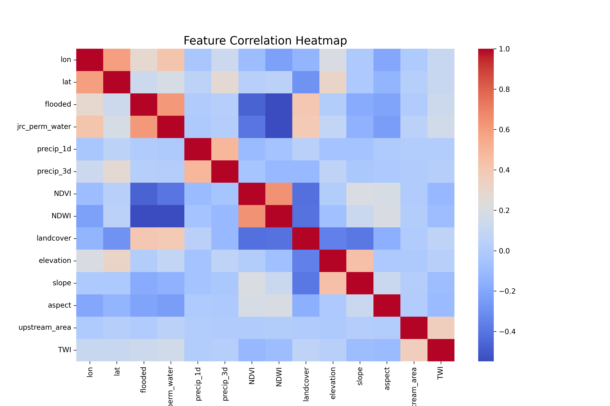

 Flood Detection using Machine Learning
 Project Overview
This project detects flood-affected areas using machine learning models trained on geospatial and environmental data. The dataset contains features like rainfall, soil moisture, vegetation index, elevation (DEM), and historical flood occurrence. The output predicts whether a given location is flooded and provides its latitude and longitude.

 Dataset
The dataset used is:

java
Copy
Edit
C:\Users\sagni\Downloads\Flood Detection\archive (1)\modis_flood_features_paling cleaning (1).csv
Key Columns:

latitude – Geographic coordinate (North-South position)

longitude – Geographic coordinate (East-West position)

Environmental & geospatial features (e.g., rainfall, NDVI, DEM)

flood – Target label (1 = Flooded, 0 = Not flooded)

 Project Workflow
Data Preprocessing

Load CSV

Handle missing values

Normalize numerical features

Encode categorical variables if needed

Model Training

Split dataset into training and testing sets

Train using RandomForestClassifier

Save trained model in:

.h5 format

.pkl format

.yaml format

.txt format

Model Evaluation

Accuracy score

Confusion matrix

Heatmap visualization

Accuracy vs. Epochs graph

Prediction

Load trained model

Predict flood occurrence for given environmental parameters

Return predicted flood status along with latitude and longitude

 Visualizations
Confusion Matrix Heatmap – Shows model performance in classification

Accuracy Graph – Tracks accuracy over training epochs

 Installation & Requirements
bash
Copy
Edit
pip install pandas numpy scikit-learn matplotlib seaborn h5py pyyaml joblib
 Running the Project
1️⃣ Train and Save Model
python
Copy
Edit
python train_flood_model.py
This will generate:

flood_model.h5

flood_model.pkl

flood_model.yaml

flood_model.txt

2️⃣ Visualize Accuracy and Heatmap
python
Copy
Edit
python visualize_results.py
3️⃣ Predict Flood Status
python
Copy
Edit
python predict_flood.py
Output Example:

makefile
Copy
Edit
Prediction: Flooded
Location: Latitude = 27.2046, Longitude = 77.4977
 Output Example
yaml
Copy
Edit
Flood Prediction: 1 (Flooded)
Latitude: 26.9124
Longitude: 75.7873
 Notes
Ensure your dataset contains latitude and longitude columns for location-based predictions.

Author
Sagnik Patra

The model can be improved by integrating real-time satellite data (e.g., MODIS, Sentinel-1 SAR).

You can deploy this using Flask or FastAPI for real-time flood monitoring.
